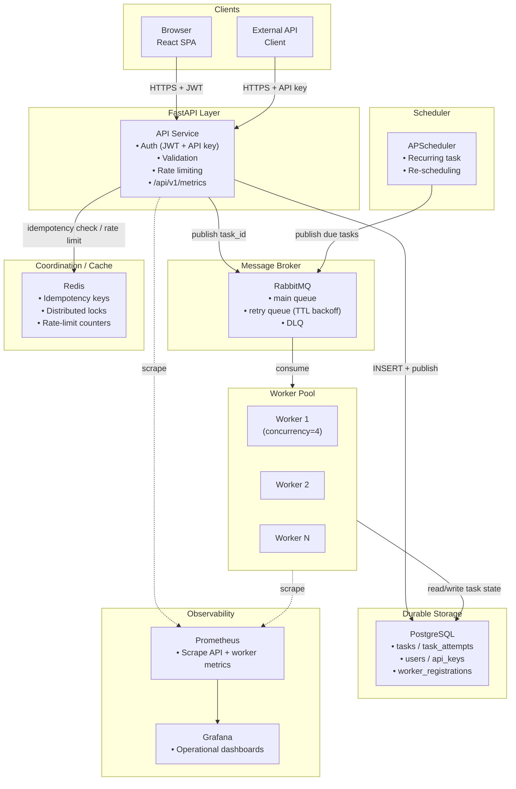
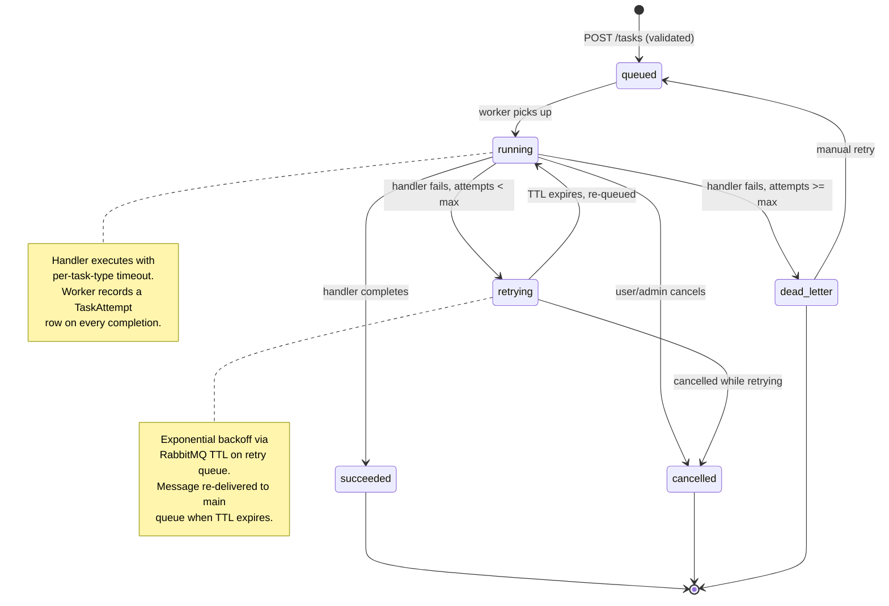
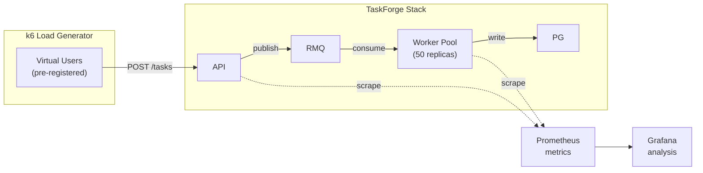

# TaskForge

> A distributed task processing platform — submit background jobs (email, image resize, webhook delivery) over a REST API, and let a horizontally scalable worker fleet process them reliably, with real retry/backoff, dead-lettering, idempotency, and worker-failure recovery.

Built to demonstrate **distributed-systems** and **backend engineering** depth: correct queueing semantics, failure handling, and observability — not just CRUD plumbing.

---


## Problem

Doing background work synchronously inside an API request makes that request slow and fragile. The DIY alternative — a hand-rolled queue with no real retry, ack, or dead-letter semantics — quietly loses or duplicates work. TaskForge uses a real message broker, durable storage, and an explicit worker lifecycle to make every failure mode **visible and recoverable** instead of silent.

## Architecture



### Task Lifecycle



## Key Distributed-Systems Features

| Concept | Implementation |
|---|---|
| **At-least-once delivery** | RabbitMQ manual acks + redelivery-on-disconnect — no silent loss on worker crash |
| **Idempotency** | Two-layer guard: Redis fast-path for common-case rejection, PostgreSQL unique constraint as the authoritative backstop |
| **Retry with backoff** | Per-attempt TTL on a dedicated retry queue; each attempt is a permanent `TaskAttempt` record in Postgres |
| **Dead-letter queue** | Native RabbitMQ DLQ per task type; exhausted tasks land in `dead_letter` status, visible and manually replayable |
| **Worker heartbeat** | Periodic `last_heartbeat_at` updates in Postgres; dashboard shows online/offline fleet status (separate from message redelivery, which uses AMQP connection-drop detection) |
| **Visibility timeout** | Provided natively by RabbitMQ unacked-message redelivery — no custom lease system needed |
| **Horizontal scaling** | Workers are stateless consumers; add a container, no code change required |
| **Scheduled / recurring tasks** | Scheduler service scans for due `recurrence_rule` tasks, publishes new task rows into RabbitMQ using the same path as normal submission |

## Security

| Concern | Mitigation |
|---|---|
| **SSRF** | `validate_url_ssrf_safe()` resolves the hostname and rejects private/loopback/link-local/multicast IPs; applied in `image_resize` and `webhook_delivery` handlers |
| **Password storage** | bcrypt hashing, never stored in plaintext |
| **API key storage** | SHA-256 hash stored; raw key shown once at creation, never retrievable again |
| **JWT sessions** | Short-lived access tokens (15 min) + revocable refresh tokens (30 days, hashed in Postgres) |
| **Input validation** | Every request body validated against a strict per-type Pydantic schema before touching the database or being queued |
| **Rate limiting** | Redis fixed-window counters per API key / per-user (60/min submission, 20/min auth) |
| **Least privilege** | Workers run as unprivileged `taskforge` user; Postgres/Redis/RabbitMQ not exposed on public ports in production |

See [`Docs/SECURITY.md`](Docs/SECURITY.md) for the full threat model and checklist.

## Observability

- **Prometheus** scrapes three metric sources: API (`/api/v1/metrics`), workers (`/metrics` on port 9001), and RabbitMQ (Prometheus plugin on port 15692).
- **Grafana** dashboards:
  - [TaskForge](monitoring/grafana/provisioning/dashboards/taskforge.json) — 8-panel operational view (submission rate, failure rate, duration, queue depth, throughput, latency, in-progress, attempts rate).
  - [Load Test](monitoring/grafana/provisioning/dashboards/loadtest.json) — 12-panel view for bottleneck analysis (p99 latency, DB connections, worker health, k6 metrics).
- **`/healthz`** endpoint returns per-component status (database, Redis, RabbitMQ) for liveness/readiness probes.

## Load Testing

A [`k6`](https://k6.io/) harness drives task submissions against the stack with 50+ worker replicas, measuring the actual throughput ceiling and identifying the bottleneck component.



**Test scenarios:** baseline (10 VUs, 5 min), stress (50 VUs, 10 min), spike (ramp 10→200, 9 min), endurance (30 VUs, 30 min).

```bash
# Start the load-test overlay (50 worker replicas)
docker compose -f docker-compose.yml -f docker-compose.loadtest.yml up -d

# Run all scenarios via the bundled script
./load-tests/run-tests.sh        # Linux/macOS
.\load-tests\run-tests.ps1       # Windows
```

Throughput results are measured and reported in the load-test output — no assumed numbers.

<!-- TODO: populate with load-test results after running -->

## Tech Stack

| Layer | Technology |
|---|---|
| **Backend API** | Python 3.12 · FastAPI · SQLAlchemy (async) · Alembic |
| **Task Queue** | RabbitMQ (aio-pika) — main / retry / DLQ queues per task type |
| **Database** | PostgreSQL 16 — source of truth for tasks, attempts, users, workers |
| **Coordination** | Redis 7 — idempotency keys, distributed locks, rate-limit counters |
| **Worker** | Custom async loop (aio-pika) — no Celery; the queueing mechanics are the point |
| **Scheduler** | APScheduler + croniter — recurring task re-scheduling |
| **Frontend** | React 19 · TypeScript · Tailwind CSS · React Query 7 · React Router 7 |
| **Observability** | Prometheus · Grafana |
| **Load Testing** | k6 |
| **Infrastructure** | Docker Compose (local) · Managed PaaS (prod) · GitHub Actions (CI/CD) |

See [`Docs/TECHSTACK.md`](Docs/TECHSTACK.md) for the full rationale, including alternatives considered and rejected.

## Project Structure

```
TaskForge/
├── backend/                    # FastAPI application
│   ├── app/
│   │   ├── main.py             # FastAPI entry point, /api/v1/metrics, /healthz
│   │   ├── config.py           # Pydantic-settings configuration
│   │   ├── database.py         # Async SQLAlchemy engine + session factory
│   │   ├── core/
│   │   │   ├── security.py     # bcrypt, JWT, API key generation
│   │   │   ├── deps.py         # Dual-auth dependency (JWT + API key)
│   │   │   ├── redis.py        # Idempotency, locks, rate limits
│   │   │   ├── rabbitmq.py     # aio-pika publisher singleton
│   │   │   ├── ssrf.py         # SSRF URL validation
│   │   │   └── rate_limit.py   # Redis fixed-window rate limiter
│   │   ├── models/             # SQLAlchemy ORM models (6 tables)
│   │   ├── routers/            # FastAPI route handlers
│   │   ├── schemas/            # Pydantic request/response schemas
│   │   ├── worker/
│   │   │   ├── main.py         # Worker consumer loop
│   │   │   ├── metrics.py      # Prometheus counters/histograms
│   │   │   └── handlers/       # email.py, image.py, webhook.py
│   │   └── scheduler/
│   │       └── main.py         # APScheduler recurring-task service
│   └── alembic/                # Database migrations
├── frontend/                   # React 19 + TypeScript dashboard
│   └── src/
│       ├── App.tsx             # Router + auth provider
│       ├── api/client.ts       # Axios instance with auto-refresh
│       ├── context/AuthContext.tsx
│       ├── components/         # Layout, ProtectedRoute
│       └── pages/              # Auth, Dashboard (Tasks, TaskDetail, ApiKeys)
├── monitoring/                 # Prometheus + Grafana config
│   ├── prometheus.yml
│   └── grafana/provisioning/
│       ├── dashboards.yaml
│       ├── dashboards/
│       │   ├── taskforge.json  # Operational dashboard
│       │   └── loadtest.json   # Load-test analysis dashboard
├── load-tests/                 # k6 load testing harness
│   ├── k6/taskforge.js         # 4 scenarios: baseline, stress, spike, endurance
│   ├── run-tests.sh            # Bash runner (Linux/macOS)
│   ├── run-tests.ps1           # PowerShell runner (Windows)
│   └── README.md
├── docker-compose.yml          # Full stack (postgres, redis, rabbitmq, api, worker, scheduler, prometheus, grafana)
├── docker-compose.loadtest.yml # Load-test overlay (50 worker replicas, relaxed limits)
├── Dockerfile.api              # API service container
├── Dockerfile.worker           # Worker service container
├── Dockerfile.scheduler        # Scheduler service container
├── .github/workflows/
│   ├── ci.yml                  # Lint → test → build → security scan
│   └── deploy.yml              # Deploy on main-branch merge
└── Docs/                       # Project documentation
    ├── PRD.md                  # Product requirements
    ├── FEATURES.md             # Feature spec by priority
    ├── ARCHITECTURE.md         # System design, lifecycle, scaling
    ├── DATABASE.md             # Schema, indexes, Redis structures
    ├── API.md                  # REST API reference
    ├── SECURITY.md             # Threat model
    ├── TECHSTACK.md            # Technology rationale
    └── DEPLOYMENT.md           # Local, Docker, production, CI/CD
```

## Local Setup

```bash
git clone <repo-url>
cd taskforge
cp .env.example .env
docker compose up -d postgres redis rabbitmq
docker compose run --rm api alembic upgrade head
docker compose up -d api worker scheduler
cd frontend && npm install && npm run dev
```

| Service | URL |
|---|---|
| API (FastAPI) | http://localhost:8000 |
| API docs (Swagger) | http://localhost:8000/docs |
| Frontend dashboard | http://localhost:5173 |
| RabbitMQ management | http://localhost:15672 |
| Prometheus | http://localhost:9090 |
| Grafana | http://localhost:3000 (admin/admin) |

See [`Docs/DEPLOYMENT.md`](Docs/DEPLOYMENT.md) for production deployment instructions.

## API Quick Start

```bash
# Register
curl -X POST http://localhost:8000/api/v1/auth/register \
  -H 'Content-Type: application/json' \
  -d '{"email":"dev@example.com","password":"SecurePass1!"}'

# Login
curl -X POST http://localhost:8000/api/v1/auth/login \
  -H 'Content-Type: application/json' \
  -d '{"email":"dev@example.com","password":"SecurePass1!"}'

# Create an API key (for programmatic access)
curl -X POST http://localhost:8000/api/v1/api-keys \
  -H 'Authorization: Bearer <access_token>' \
  -H 'Content-Type: application/json' \
  -d '{"name":"my-key"}'

# Submit a task
curl -X POST http://localhost:8000/api/v1/tasks \
  -H 'Authorization: Bearer <access_token>' \
  -H 'Content-Type: application/json' \
  -d '{
    "task_type": "image_resize",
    "payload": {
      "source_url": "https://httpbin.org/image/png",
      "width": 200,
      "height": 200
    },
    "max_attempts": 3
  }'
```

Full endpoint reference: [`Docs/API.md`](Docs/API.md).

## Documentation

| Doc | Contents |
|---|---|
| [`Docs/PRD.md`](Docs/PRD.md) | Product requirements, goals, non-goals, MVP scope |
| [`Docs/FEATURES.md`](Docs/FEATURES.md) | Full feature spec by priority and complexity |
| [`Docs/ARCHITECTURE.md`](Docs/ARCHITECTURE.md) | System design, task lifecycle, failure scenarios, scaling |
| [`Docs/DATABASE.md`](Docs/DATABASE.md) | Schema, indexes, Redis structures, queue metadata |
| [`Docs/API.md`](Docs/API.md) | REST API endpoint reference |
| [`Docs/SECURITY.md`](Docs/SECURITY.md) | Threat model, security checklist |
| [`Docs/TECHSTACK.md`](Docs/TECHSTACK.md) | Technology choices and rationale |
| [`Docs/DEPLOYMENT.md`](Docs/DEPLOYMENT.md) | Local setup, Docker, production, CI/CD, monitoring |

## What's Not Yet Built

The project targets **Phases 1–7**. Phase 8 (next) includes:

- **Integration tests** — unit, integration against real Postgres/RabbitMQ/Redis, failure tests, concurrency tests
- **Admin API endpoints** — `GET /workers`, `GET /workers/:id`, `GET /queues` (documented but not implemented)
- **Refresh token rotation** — issue a new refresh token on each use
- **Postgres exporter** — DB-level metrics for bottleneck analysis
- **Alerting rules** — Prometheus alertmanager integration
- **Backpressure** — submission throttling at high queue depth

## Design Decisions Worth Discussing

**Why RabbitMQ over a Redis list queue?**  
Manual ack semantics are what make crash-safe redelivery possible without hand-rolled visibility-timeout polling. Native DLQ and per-message TTL for retry backoff are broker features, not application logic to build and debug.

**Why a custom worker instead of Celery?**  
Celery would hide the exact mechanics (queueing, acking, retry, DLQ routing) that this project exists to demonstrate. Building the consumer loop directly makes the distributed-systems design explorable and defensible.

**Why not a general-purpose code execution platform?**  
Arbitrary handler execution turns this into a sandboxing problem, which is a different and much larger engineering challenge. The fixed 3-task-type scope keeps the security model tractable and focuses depth on the queueing and reliability layer.

**Why Postgres for tasks instead of Redis?**  
Task data is inherently relational (a task belongs to a user, has many attempts). Strong consistency and referential integrity matter more than write throughput at the target load. Redis holds only transient coordination data (idempotency, locks, rate limits) — if it restarts, no task is lost.

---

*This project was built as a single-developer portfolio artifact to demonstrate distributed-systems engineering depth. All performance claims are either design targets or backed by actual load-test measurements — no numbers are assumed.*
